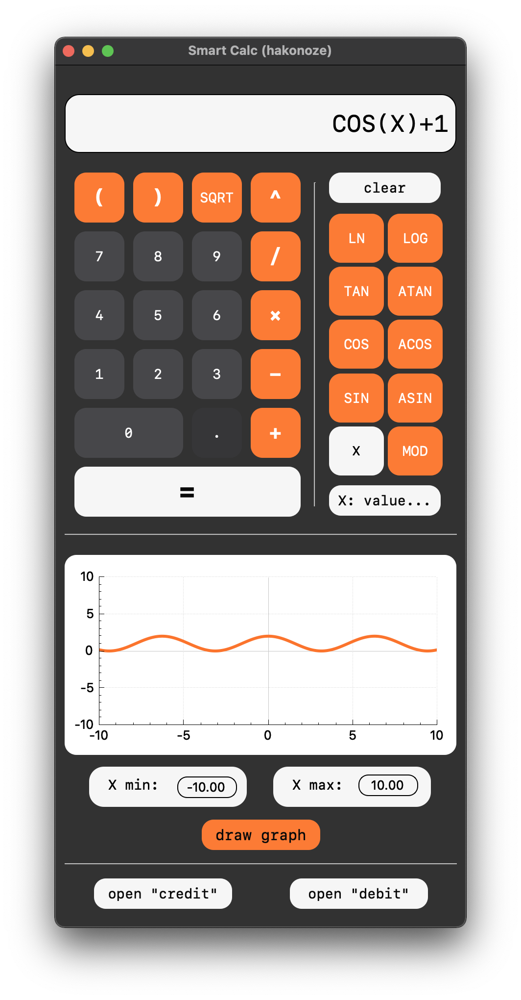

# SmartCalc v1.0

    
    

**SmartCalc v1.0** - это умный калькулятор, разработанный на языке “C”, который позволяет выполнять различные вычисления и предоставляет дополнительные функции, такие как кредитный и депозитный калькуляторы. Программа использует обратную польскую нотацию для выполнения вычислений, а также предоставляет графический интерфейс пользователя на базе библиотеки Qt.

## Основные

1. **Модульная структура**: Код программы структурирован в соответствии со стандартом разработки на языке C11. Основная логика программы находится в файлах **`smartcalc.h`**, **`calculate.c`**, **`credit_calc.c`**, **`polish.c`**, **`validation.c`**, и **`help.c`**. Файлы на C++ (**`Smart_Calc_QT`**) предназначены для создания графического пользовательского интерфейса с использованием библиотеки Qt.
2. **Стиль кодирования**: При написании кода придерживается стиля кодирования Google Style, чтобы обеспечить читаемость и понимание кода.
3. **Unit-тесты**: Программа обеспечивает покрытие unit-тестами для модулей, связанных с вычислением выражений, с использованием библиотеки Check. Это обеспечивает надежность и качество вычислений.

## Дополнительные функции

### Кредитный калькулятор

SmartCalc v1.0 предоставляет специальный режим "кредитный калькулятор", который позволяет пользователю рассчитать параметры кредита.

### Депозитный калькулятор

SmartCalc v1.0 также предоставляет специальный режим "калькулятор доходности вкладов", который позволяет пользователю рассчитать доходность вклада.

## Установка

Для установки SmartCalc v1.0 выполните следующие шаги:

1. Убедитесь, что на вашем компьютере установлена библиотека `qmake6`. Если она отсутствует, вы можете установить её на macOS с помощью команды: `**brew install qt@6**`
2. Перейдите в директорию `src`, где находятся исходные файлы проекта
3. Выполните команду `**make install**` для сборки и установки программы:

**Примечание**: Убедитесь, что на вашей системе также установлены необходимые зависимости для сборки и компиляции C и C++ программ.